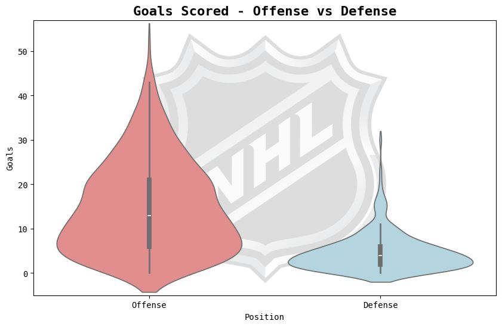
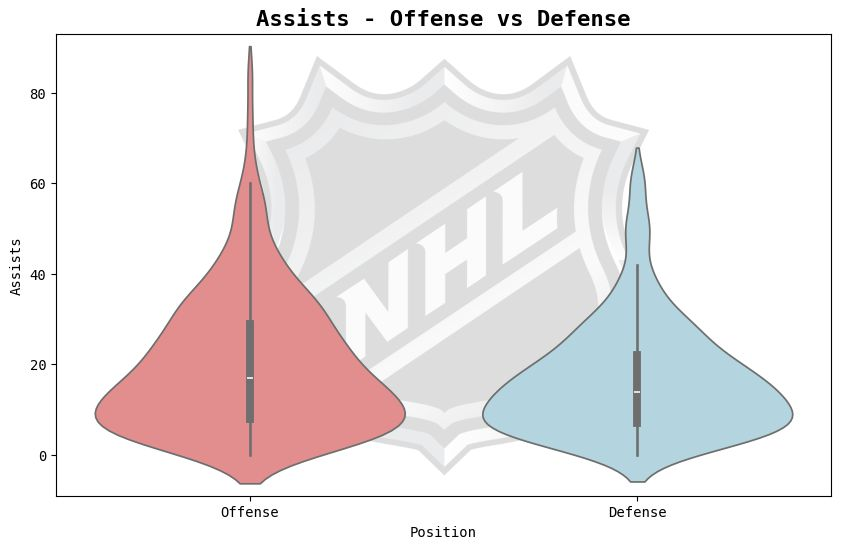
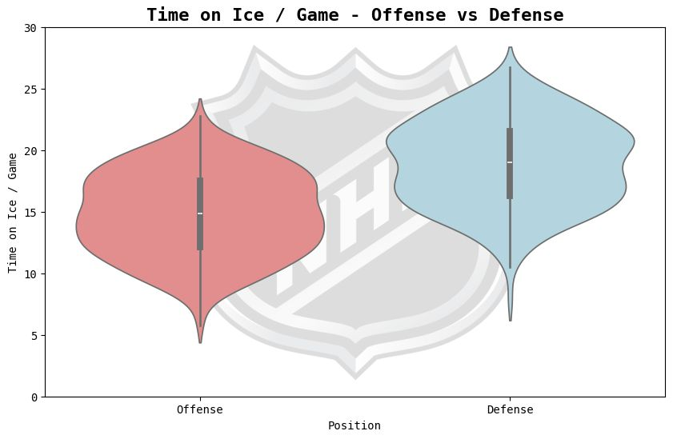
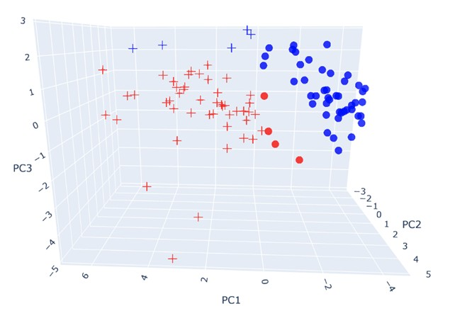

# 🏒 Shifting Lines: Visualizing NHL Role Crossovers

**Can NHL players be miscast in their roles? Are some defenders really attackers in disguise?**  
This project explores NHL Role Crossovers using data-driven visualizations and machine learning techniques.

---

## 🎯 Inspiration

While watching the Florida Panthers vs. Toronto Maple Leafs series, something caught my attention during Game 5. Panthers’ defensemen **Aaron Ekblad** and **Dmitry Kulikov** scored back-to-back opening goals — a moment commentators noted as a first in NHL history.

That (sad) moment made me wonder:  
> “Are there defenders who would be better suited as forwards? Are teams underutilizing players by locking them into rigid roles?”

Those questions kicked off this project.

---

## 🧠 What Makes Offense and Defense Distinct?

To understand potential role crossovers, we examined how offensive and defensive players differ statistically:

- **Offensive players** score more goals and take more shots on target.
- **Assist rates** are relatively similar, though forwards have a larger distribution.
- **Defenders** tend to have more time on ice and more positive goal differentials, possibly due to their presence in critical moments.
- **Point totals** skew heavily toward offensive players — though a few standout defenders blur the line.





---

## 🔍 Can We Spot Misused Players?


To identify players who may be miscast in their roles, we used **K-Means clustering** on core player stats. This unsupervised learning method grouped players by statistical similarity — regardless of their listed position.

### Highlights:
- **4 defenders** were grouped with offensive players.
- **5 forwards** were grouped with defenders.

These clusters may suggest untapped flexibility in team strategies or underutilized talent.


---

## 🌟 Spotlight on Role-Bending Players


Here are a few players that defy traditional roles:

- **Cale Makar (D):** One of the league’s top goal scorers — despite playing defense.
- **Jake Sanderson (D):** Statistically mirrors elite forwards; could thrive in a more offensive role.
- **Dylan Cozens (C):** Clustered with defenders, not due to defensive skill, but a weaker offensive season.
- **Fabian Zetterlund (C):** May have been grouped with defenders due to his high positive goal differential.

📊 *Insert individual player stat breakdowns or radar charts here*

---

## 🔗 What Do Similarities Reveal?

We also built a **k-Nearest Neighbors (k-NN) similarity graph** to explore player playstyle resemblance.

### Key Insights:
- Most defenders are similar to other defenders — and likewise for forwards.
- Players from the same team don’t necessarily play alike.
- **Cale Makar** again shows strong ties to offensive players.
- **Jake Sanderson** displays hybrid similarity, supporting his flexible profile.

📊 *Insert similarity network graph here*

---

## ⚠️ Limitations of Our Approach

A major limitation was the **limited stat coverage** available from NHL’s public data. This restricts how robust our clustering and similarity analysis can be.

For example:
- **Dylan Cozens** was grouped with defenders due to weak offensive stats — not strong defense.
- He shares similar "statistical weaknesses" with defenders but lacks true defensive indicators.
- His most similar players (via k-NN) were all forwards, highlighting the flaw in clustering logic.

---

## ✅ Takeaway

By analyzing performance beyond just positional labels, we uncover players whose roles may be optimized or reimagined. Some defenders play like attackers. Some forwards could thrive in defense.

As NHL teams continue to embrace analytics, we may see lineups evolve based on performance profiles — not just tradition.

> And hey, maybe Ottawa wins the next Battle of Ontario with a few bold role swaps.  
> (*though probably not 😅*)

---

## 🛠️ Tech Stack

- **Python**
- **pandas**, **scikit-learn**, **matplotlib**, **seaborn**
- **NHL Public API**

---

## 📁 Project Structure

```bash
📦 nhl-role-crossovers/
├── data/                   # Cleaned NHL player stats
├── notebooks/              # EDA and clustering experiments
├── models/                 # K-means and k-NN implementations
├── visualizations/         # Plots and graphs
├── full_report/            # The full detailed report
├── README.md               # This file
